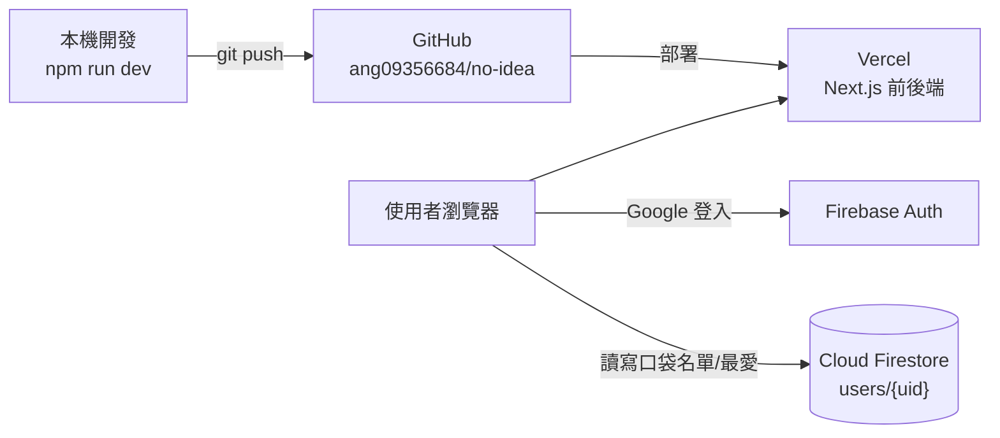

# No Idea — 部署文件（前端 + 後端）

這份文件記錄整個 app 怎麼部署、用到哪些服務、怎麼更新與維護。全部走**免費方案**。

---

## 1. 架構總覽

App 拆成三個平台，各司其職、全部免費：

| 平台 | 負責 |
|---|---|
| **GitHub** | 原始碼 |
| **Firebase**（Google）| 使用者**登入**（Google）＋**資料庫**（Cloud Firestore）|
| **Vercel** | **網站主機**：跑 Next.js 前端 + 伺服器端 API routes（`/api/generate` 等）|



### 資料分流（重要設計）

| 資料 | 存哪 | 說明 |
|---|---|---|
| 共用活動 catalog（展演/電影/景點…）| **靜態檔** `data/combined/*.json` | 所有人一樣，隨部署出貨，伺服器端 `generate` 讀取 |
| 每位使用者的**口袋名單 / 最愛** | **Cloud Firestore** `users/{uid}/…` | 各人各自，前端 Firebase SDK 直連 |
| UI 偏好（配色/深淺色）| 瀏覽器 `localStorage` | 需載入瞬間同步讀，不上雲 |

推薦流程：前端把使用者的口袋名單放進 `POST /api/generate` 的 body，伺服器把「靜態 catalog ＋ 帶上來的名單」合併後回傳——**伺服器全程無狀態、不寫檔**。

---

## 2. 已佈建的資源

| 平台 | 資源 | 值 / 位置 | 方案 |
|---|---|---|---|
| Google 帳號 | 擁有者 | `ang09356684@gmail.com`（個人）| — |
| Firebase | 專案 | 顯示名 **noidea**，ID **`noidea-5828dd`** | **Spark 免費** |
| Firebase | Firestore | `(default)`，Native 模式，`asia-east1`（台灣）| Spark 免費 |
| Firebase | Web App ID | `1:478941934835:web:6025f4647e549c6e2eb386` | — |
| Firebase | 登入方式 | Google（已啟用）| — |
| GitHub | repo | https://github.com/ang09356684/no-idea （public）| 免費 |
| Vercel | 專案 | `no-idea`（team `angus-proj`）| **Hobby 免費** |
| Vercel | 正式網址 | https://no-idea-green.vercel.app （另有 `no-idea-angus-proj.vercel.app` 等別名，皆指向同一站）| — |

> 這三個 `*.vercel.app` 是**同一個網站的多個入口別名**，不是三個站。每次部署另有一個帶 hash 的「該次部署專屬」網址（會變，不用理會）。

---

## 3. 環境變數

6 個 `NEXT_PUBLIC_FIREBASE_*`（Firebase Web 設定，**公開值**，會 inline 進前端 bundle）：

```
NEXT_PUBLIC_FIREBASE_API_KEY
NEXT_PUBLIC_FIREBASE_AUTH_DOMAIN          = noidea-5828dd.firebaseapp.com
NEXT_PUBLIC_FIREBASE_PROJECT_ID           = noidea-5828dd
NEXT_PUBLIC_FIREBASE_STORAGE_BUCKET       = noidea-5828dd.firebasestorage.app
NEXT_PUBLIC_FIREBASE_MESSAGING_SENDER_ID  = 478941934835
NEXT_PUBLIC_FIREBASE_APP_ID               = 1:478941934835:web:6025f4647e549c6e2eb386
# 本機用 Firebase Emulator 才設 true（離線開發）
NEXT_PUBLIC_USE_FIREBASE_EMULATOR
```

設定位置：

| 環境 | 來源 | 進 git？ |
|---|---|---|
| 本機 | `.env.local` | ❌ gitignore |
| Vercel（線上）| 專案 Settings → Environment Variables（Production）| ❌ |
| 範本 | `.env.example`（只有變數名、無值）| ✅ |

完整 `apiKey` 等值請見本機 `.env.local`，或到 **Firebase console → 專案設定 → 你的 Web App** 取得。

> ⚠️ `NEXT_PUBLIC_*` 在 `vercel build` 時就被**寫死 inline** 進 bundle。之後改這些值，**必須重新部署**才會生效。

---

## 4. Firebase 設定（如何重現 / 維護）

全部用 Firebase CLI，帳號為 `ang09356684@gmail.com`（`firebase login`）。

```bash
# 1. 建立專案 + Web App
firebase projects:create noidea-xxxx --display-name "noidea"
firebase apps:create web "noidea-web" --project noidea-5828dd
firebase apps:sdkconfig web --project noidea-5828dd   # 取得 6 個設定值

# 2. 建立 Firestore + 部署規則（deploy 會自動啟用 API、走 Spark 免費路徑建 DB）
firebase deploy --only firestore:rules --project noidea-5828dd

# 3. 啟用 Google 登入 → Firebase console（無 CLI）：
#    Authentication → 開始使用 → Sign-in method → Google → Enable → 選 support email → 儲存
```

**Authorized domains**（決定哪些網域能登入）目前包含：
`localhost`、`noidea-5828dd.firebaseapp.com`、`noidea-5828dd.web.app`、以及 3 個 Vercel 網域。
新增網域可在 console（Authentication → Settings → Authorized domains），或用 Identity Toolkit Admin API（`PATCH .../config?updateMask=authorizedDomains`）。

**Security Rules**（`firestore.rules`）——每位使用者只能讀寫自己的資料：

```
match /users/{uid}/{document=**} {
  allow read, write: if request.auth != null && request.auth.uid == uid;
}
```

> 註：直接呼叫 Firestore `databases.create` REST API 會要求 billing；但 `firebase deploy` 走的是 Spark 免費佈建路徑，所以本專案的 DB 是免費建立的。

---

## 5. Vercel 部署 / 更新

**首次部署（已完成）**：
```bash
vercel login                         # 用 GitHub(ang09356684)，選 Hobby 免費方案
vercel link --yes --project no-idea  # 建立/連結專案
# 設定 6 個 production 環境變數：
printf "<value>" | vercel env add NEXT_PUBLIC_FIREBASE_API_KEY production   # 其餘 5 個同理
vercel --prod --yes                  # 正式部署（Vercel 上 build + 上線）
```

**之後要更新線上（目前方式）**：本機跑
```bash
vercel --prod
```

**（可選）改成 GitHub 自動部署**：尚未啟用。需先在 Vercel 後台把 GitHub 設成 Login Connection，然後：
```bash
vercel git connect
```
之後每次 `git push` 到 `master` 就會**自動部署**（免費）。

---

## 6. 本機開發

```bash
npm install
npm run dev            # http://localhost:3000（被占用會自動換 3001）
```

- `.env.local` 直連**雲端 Firestore** → 本機和線上**共用同一份資料**（同一 Google 帳號到哪都看到同一份）。
- 想完全離線、不碰雲端：`.env.local` 設 `NEXT_PUBLIC_USE_FIREBASE_EMULATOR=true`，並 `firebase emulators:start`（需安裝 Java + firebase-tools）。

---

## 7. 常見維護流程（runbook）

| 要做的事 | 步驟 |
|---|---|
| 改前端/後端程式 | 改 code → `git commit` → `git push` → `vercel --prod`（或自動部署）|
| 更新活動 catalog | 本機 `npm run dev` → 打 `POST /api/sync` 重抓 → 重生 `data/combined/*` → `git commit` → 部署 |
| 改 Firestore 規則 | 編輯 `firestore.rules` → `firebase deploy --only firestore:rules` |
| 新增可登入網域 | Firebase console → Authentication → Settings → Authorized domains |
| 改環境變數 | 改 Vercel env（及本機 `.env.local`）→ **重新部署** |

> `/api/sync` 含 Playwright 且會寫檔，**只能在本機跑**；線上已加 production guard 擋掉（回 403）。

---

## 8. 費用：零成本

| 服務 | 免費額度 | 超過會怎樣 |
|---|---|---|
| Firebase Firestore（Spark）| 1 GiB、5 萬讀/2 萬寫 每日 | 回錯誤、**不收費** |
| Firebase Auth（Spark）| Google 登入免費 | — |
| Vercel（Hobby）| 100 GB 流量/月等 | 節流、**不超額計費** |

**結構性保證**：Firebase 專案**沒有綁定帳單帳號**（Spark），所以**不可能產生費用**——用量到頂只會暫停服務到隔天，不會扣款。唯一會收費的途徑是主動升級 Blaze（綁卡），**請勿升級**。Vercel Hobby 為個人非商業用途。

---

## 9. 安全

- **`apiKey` 公開是正常的**：它是識別碼不是密鑰，安全性靠 Firebase Auth + Firestore Rules，不是靠藏它。
- **跨使用者隔離**：Firestore Rules 鎖定 `users/{uid}`，使用者彼此讀不到對方資料（伺服器端強制）。
- **repo 無任何機密**：已掃描確認 `.env*` 被 gitignore、無 service account 私鑰、commit 歷史無 apiKey/私鑰。
- **登入來源限制**：Authorized domains 限制只有指定網域能發起 Google 登入。

---

## 10. 疑難排解

| 症狀 | 原因 / 解法 |
|---|---|
| 線上登入跳 `auth/unauthorized-domain` | 該網域沒加進 Firebase Authorized domains |
| 線上完全沒推薦結果 | `data/combined/*.json` 沒被 commit（catalog 沒出貨），或 build 時 env 沒設 |
| 登入成功但看不到資料 | 確認是同一個 Google 帳號；確認 Firestore Rules 已部署 |
| 改了環境變數沒生效 | `NEXT_PUBLIC_*` 在 build 時凍結，要**重新部署** |
| 本機新增的資料線上看不到 | 確認 `.env.local` 沒開 emulator（`NEXT_PUBLIC_USE_FIREBASE_EMULATOR` 應留空）|

---

_相關文件：實作規劃見 [`plan/15-firebase-auth-firestore.md`](plan/15-firebase-auth-firestore.md)。_
